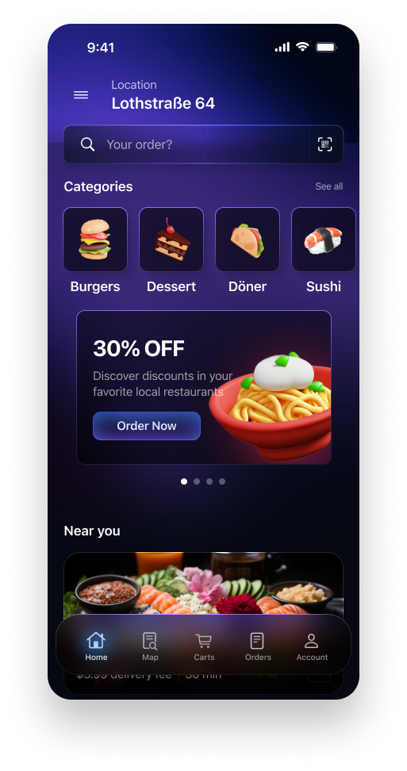

  

Real-time flash deals connecting local restaurants with customers to fill empty tables.

About Sponti
Sponti is a location-based application designed to bridge the gap between hungry customers and restaurants with surplus capacity. By leveraging real-time geolocation and AI-driven insights, restaurants can generate "flash deals" to attract nearby customers instantly.
